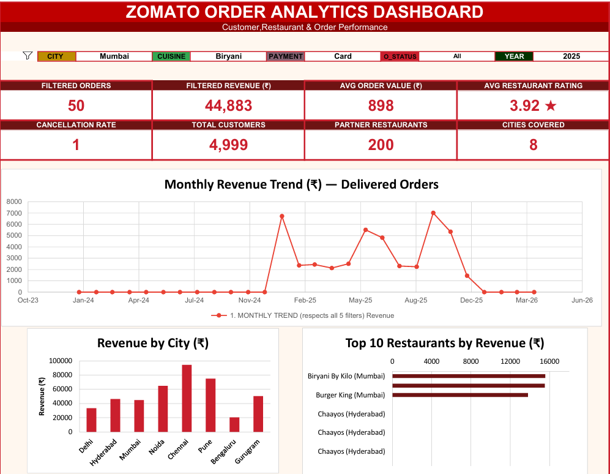
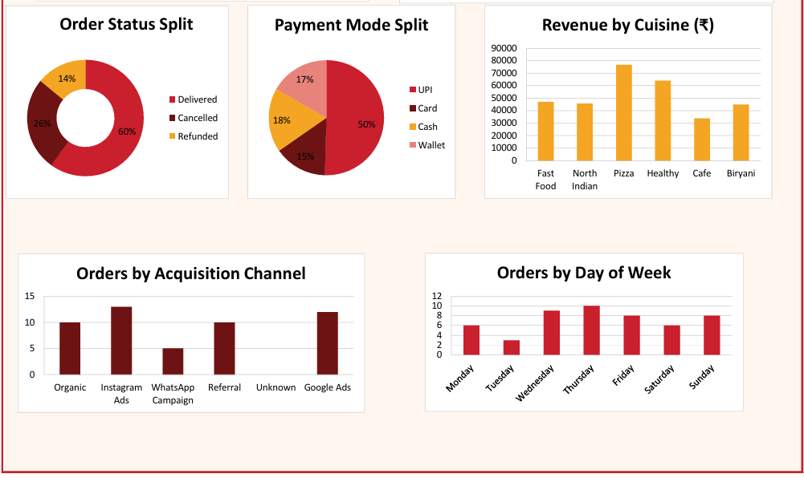

# 🍽️ Zomato Order Analytics Dashboard

An interactive Excel dashboard built entirely with native formulas (SUMIFS/COUNTIFS/INDEX-MATCH) — no VBA, no macros, no external plugins. Analyzes **50,000+ orders** across **200 restaurants**, **5,000 customers**, and **8 cities**, with **5 live filters** driving **8 KPI cards** and **8 charts** in real time.

---

## 📸 Dashboard Preview

### Dashboard 1


### Dashboard 2


---

## ✨ Features

- **5 live filters** — City, Cuisine, Payment Mode, Order Status, Year (native Data Validation dropdowns)
- **8 KPI cards** — Filtered Orders, Filtered Revenue, Avg Order Value, Avg Restaurant Rating, Cancellation Rate, Total Customers, Partner Restaurants, Cities Covered
- **8 interactive charts**

---

## 📂 Workbook Structure

| Sheet | Purpose |
|--------|---------|
| **Dashboard** | The visual front-end — filters, KPI cards, and all 8 charts |
| **Calc_Engine** | Formula layer — every SUMIFS/COUNTIFS breakdown table that feeds the charts and KPIs |
| **Data_Orders** | 50,000 orders, enriched with lookup columns (customer/restaurant info, revenue, weekday, etc.) |
| **Data_Customers** | 5,000 customer records |
| **Data_Restaurants** | 200 restaurant records |

---

## 🧮 How It Works

Every chart and KPI reads from **Calc_Engine**, which recalculates live off the **5 filter cells** on the **Dashboard** tab (**C5, F5, I5, L5, O5**). Each filter is translated into a wildcard-friendly **SUMIFS/COUNTIFS** criterion:

```excel
CityCrit = IF(Dashboard!$C$5="All", "*", Dashboard!$C$5)
```

This lets a single set of formulas serve both the **"All"** case and any specific selection, without helper macros. Breakdown tables (by City, Restaurant, Cuisine, Payment Mode, Order Status, Acquisition Channel, Weekday, and Month) are pre-built for every distinct value, so charts just point at static ranges in **Calc_Engine** that update in place when a filter changes.

### Data Enrichment

**Data_Orders** (columns **J:X**) uses **VLOOKUP** to pull in:

- Customer name / city / acquisition channel
- Restaurant name / cuisine / city / rating
- Derived date fields (year, month, weekday, year-month key)
- Net amount and total revenue *(order_amount − discount + delivery_fee)*

---

## 🛠️ Built With

**Microsoft Excel** — Tables, Data Validation, native charts

**Formula Stack**

- SUMIFS
- COUNTIFS
- AVERAGEIFS
- INDEX/MATCH
- LARGE
- SUMPRODUCT
- VLOOKUP
